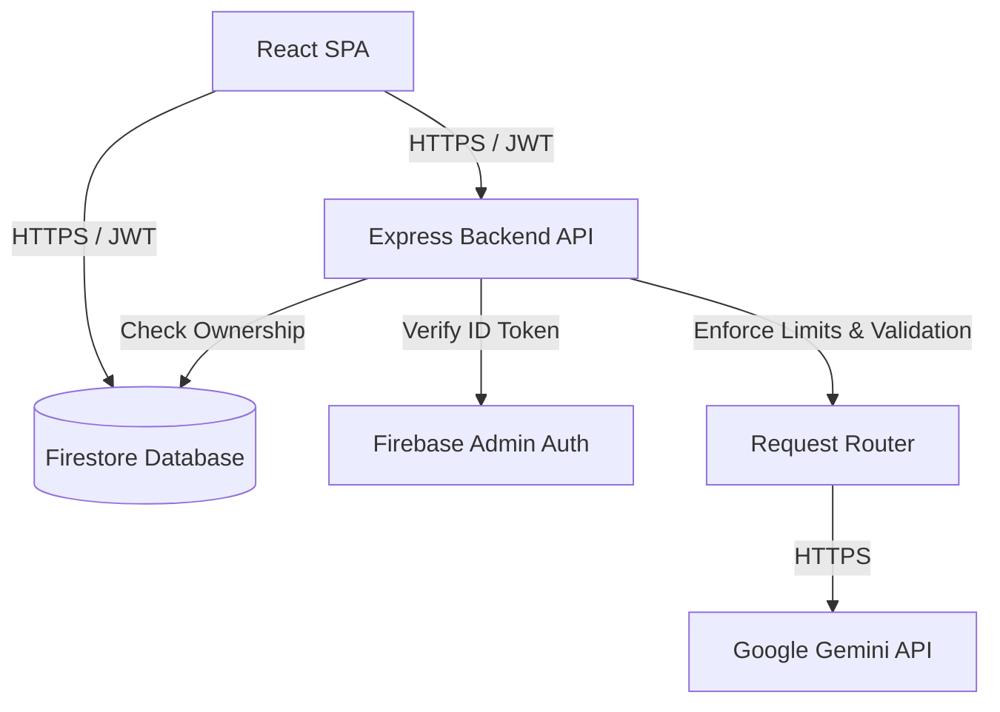

# QYVRIN
## Think beyond the numbers.

QYVRIN is an AI-powered Financial Decision Intelligence application designed to help professionals and individuals understand their financial choices, challenge assumptions, explore potential failure scenarios, and learn from previous outcomes. 

Instead of just tracking expenses, QYVRIN provides a structured lifecycle for decision-making—from the initial journal entry to a long-term behavioral fingerprint.

## Problem
Financial decisions are often made using intuition or incomplete mental models, lacking structured review. Once a decision is made, the rationale is forgotten, making it difficult to objectively compare what was expected against what actually happened. Without a mechanism to analyze past decisions, users repeat behavioral patterns and cognitive biases.

## Solution
QYVRIN solves this by enforcing a structured decision lifecycle:
1. **Capture:** Document the context of a decision via Journal Entries.
2. **Analyze:** Use AI to unpack assumptions, gaps, and potential scenarios.
3. **Stress-Test:** Run a Pre-Mortem to proactively identify points of failure.
4. **Track:** Record Expected Outcomes vs. Actual Outcomes.
5. **Reflect:** Replay the decision retrospectively to extract lessons.
6. **Synthesize:** Map a long-term behavioral "Decision Fingerprint."
7. **Collaborate:** Safely share sanitized decision snapshots in private Decision Circles to gather structured community perspectives.

## How QYVRIN Works
The application integrates a React frontend with a secure Node.js (Express) backend. All user data is isolated securely in Cloud Firestore. When a user requests an AI analysis, the React client securely authenticates with the backend using a Firebase ID token. The backend enforces rate limits, validates payload sizes, applies authorization checks, and then securely orchestrates the request to the Google Gemini API using a resilient fallback ladder.

## Key Capabilities
*   **Firebase Google Sign-In:** Secure, federated identity management.
*   **User-Isolated Data:** Strict Firestore rules guarantee that private journals and decisions are only accessible by their owner.
*   **Journal Entries:** A scratchpad for documenting thoughts and financial context.
*   **Decision Circles:** Private groups where users can safely share sanitized decision snapshots.
*   **Structured Perspectives:** Circle members can contribute structured feedback (e.g., Identifying Risks, Providing Alternatives) rather than unstructured chat.
*   **Secure Sharing:** Users actively curate which data points (Assumptions, Gaps) are shared with the Circle.

## Generative AI
QYVRIN utilizes Google's Gemini models via the `@google/genai` SDK on a secure Node.js backend to provide intelligent analysis.

*   **Decision Analysis:** Extracts core variables, assumptions, and information gaps from a freeform journal entry.
*   **Pre-Mortem Mode:** Simulates future failure states based on current assumptions to uncover blind spots.
*   **Circle Synthesis:** Aggregates and synthesizes structured community perspectives into a cohesive summary of risks and considerations.

*Note: QYVRIN utilizes a resilient model fallback architecture on the server, gracefully handling `503`, `429`, and `500` errors by automatically rotating through available Gemini models.*

## Decision Replay
The Replay feature allows users to close the loop on a past decision:
1. **Original Context:** Review the initial journal entry and expected outcome.
2. **Actual Outcome:** Record the reality (Timeframe, Metric, Value, Surprises).
3. **Expectation vs. Reality:** If numeric values and timeframes are recorded, the system facilitates a direct comparison.
4. **Lesson Extraction:** The user and AI collaborate to identify what would be done differently next time.

## Decision Fingerprint
As users accumulate replayed decisions, QYVRIN analyzes the aggregate history to generate a **Decision Fingerprint**. This feature identifies recurring patterns, persistent assumptions, and measurable decision strengths across the user's historical dataset. *This is an analysis of documented decision variables, not a psychological profile.*

## Decision Circles
Decision Circles provide structured collaborative decision intelligence. 
*   **Membership:** Private groups managed by a Circle Owner.
*   **Sanitized Snapshots:** Users share a curated, sanitized version of a decision, preventing accidental leakage of raw financial journals.
*   **Synthesis:** Only the original author of the shared decision is authorized to trigger the Gemini-powered synthesis of community perspectives.

## Security & Privacy
QYVRIN is architected with strict, defense-in-depth security principles. 
*   **No End-to-End Encryption (E2EE):** To enable AI analysis, the backend must process data in plaintext. Therefore, QYVRIN does *not* use true E2EE. However, data is highly protected.
*   **Network Security:** All network communication uses encrypted transport (HTTPS/TLS).
*   **Encryption at Rest:** Data stored in Firebase/Google Cloud is encrypted at rest by default.
*   **Authentication:** Firebase ID-token verification is required on all protected Gemini endpoints.
*   **Authorization:** 
    *   Firestore Security Rules enforce strict ownership checks for reads/writes.
    *   The Node.js backend independently validates Canonical Firestore `authorId` ownership before executing expensive AI synthesis tasks.
*   **Defensive Application Controls:**
    *   Server-side Gemini API key protection (keys are never exposed to the client).
    *   Authenticated, per-user, in-memory rate limiting (e.g., 10 requests/minute/user for standard analysis).
    *   Semantic payload validation (Express JSON body limits at 100kb; main text fields capped at 10,000 characters).
    *   Generic error responses to prevent internal stack trace leakage.

## AI Grounding & Responsible AI
QYVRIN is designed as a reflection tool, **not** a financial advisor.
*   **Grounding:** AI prompts explicitly instruct the model to differentiate between user-provided facts, assumptions, and potential risks. 
*   **No Hallucinations:** The model is strictly instructed not to invent financial amounts, percentages, dates, metrics, or unsupported psychological diagnoses. 
*   **Responsible AI:** Hypothetical scenarios (like those in the Pre-Mortem) are explicitly framed as illustrative thought experiments.
*   **Disclaimer:** QYVRIN is not a substitute for professional financial, investment, tax, or legal advice. AI-generated analysis can be incomplete and must be validated against actual financial realities.

## Architecture


## Technology Stack
*   **Frontend:** React 19, TypeScript, Vite, Tailwind CSS v4, Lucide React, Framer Motion
*   **Backend:** Node.js, Express
*   **Database & Auth:** Cloud Firestore, Firebase Authentication, Firebase Admin SDK
*   **AI SDK:** `@google/genai`

## Project Structure
```text
/
├── src/
│   ├── components/       # Reusable UI components
│   ├── lib/              # Utility functions
│   ├── pages/            # React route components (Dashboard, Analysis, Circles, etc.)
│   ├── services/         # Client-side API wrappers and Firebase DB utilities
│   ├── types.ts          # Shared TypeScript interfaces
│   ├── App.tsx           # Main application router
│   └── main.tsx          # React DOM entry point
├── server.ts             # Express backend server and API endpoints
├── firestore.rules       # Firestore security and authorization rules
└── package.json          # Project dependencies and build scripts
```

## Getting Started

1. **Clone the repository:**
   ```bash
   git clone <repository-url>
   cd qyvrin
   ```

2. **Install dependencies:**
   ```bash
   npm install
   ```

3. **Configure Environment Variables:**
   Create a `.env` file in the root directory (see *Environment Variables* section).

4. **Start the development server:**
   ```bash
   npm run dev
   ```
   *The backend will boot up alongside the Vite middleware on port 3000.*

5. **Build for production:**
   ```bash
   npm run build
   ```

## Environment Variables
Create a `.env` file in the root of your project. **Never commit this file to version control.**

```env
# Required for Backend AI Capabilities (MUST remain server-side)
GEMINI_API_KEY=your_gemini_api_key

# Firebase Client Configuration (Safe for client-side VITE_ prefix)
VITE_FIREBASE_API_KEY=your_firebase_api_key
VITE_FIREBASE_AUTH_DOMAIN=your_project.firebaseapp.com
VITE_FIREBASE_PROJECT_ID=your_project_id
VITE_FIREBASE_STORAGE_BUCKET=your_project.firebasestorage.app
VITE_FIREBASE_MESSAGING_SENDER_ID=your_sender_id
VITE_FIREBASE_APP_ID=your_app_id
```

## Deployment
This project is configured to run as a bundled, full-stack Node.js application, suitable for deployment on **Google Cloud Run**.
*   **Build command:** `npm run build` compiles the React frontend into `dist/` and bundles `server.ts` into a self-contained `dist/server.cjs` file using `esbuild`.
*   **Start command:** `npm run start` launches the Node.js server.
*   **Secrets:** Ensure `GEMINI_API_KEY` is securely injected into the Cloud Run environment using Google Cloud Secret Manager.
*   **Database:** Ensure your `firestore.rules` are deployed to your Firebase project to secure client-side database access.

## Gen AI Academy APAC Ideathon
QYVRIN aligns directly with the Google Gen AI Academy APAC Edition Ideathon by demonstrating practical, real-world Generative AI usage. 
It moves beyond basic chatbots to provide a structured, authenticated workflow utilizing the Gemini API. By deploying a secure Cloud Run architecture with user-isolated data, QYVRIN showcases how Gen AI can be safely integrated into sensitive domains like financial decision intelligence.

## Limitations
*   The application enforces payload size limits and rate limiting to prevent abuse; extremely long journal entries may be truncated or rejected.
*   Decision synthesis requires the original author's authentication to trigger, meaning community members cannot generate the synthesis themselves.

## Future Scope
*Planned enhancements (not currently implemented):*
*   Data export functionalities (CSV/PDF) for offline personal record-keeping.
*   Integration with external financial aggregators for automated actual-outcome tracking.

## License
[MIT License]
